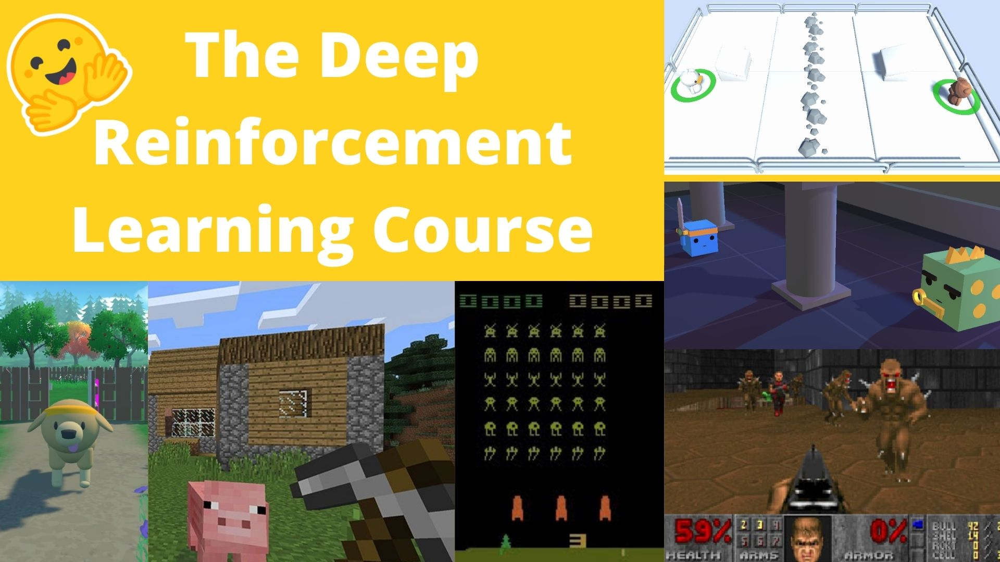

In this repo you can find my implementation for exercises of the [Deep Reinforcement Learning Course](https://huggingface.co/deep-rl-course) from [Hugging Face](https://huggingface.co/).

# MY IMPLEMENTATION

The original course material is implemented in notebooks for Google Colab. As I am lucky enough to have a good computer and I like to program my experiments in scripts, I have implemented the exercises locally using Docker and Python scripts.

# REQUIREMENTS

As I am using a Docker image to handle the dependencies of each unit/exercise, the unique requirements are:
- Install [Docker](https://docs.docker.com/get-docker/)
- A GPU and the [NVIDIA Container Toolkit](https://github.com/NVIDIA/nvidia-docker) to access the GPU from the containers
- Install [Docker Compose](https://docs.docker.com/compose/install/). If you installed Docker Desktop you should have it already installed

**Note:** The *Docker Compose* is not an strict requirement, as you could run the containers with just Docker, but it is a convenient tool to handle the containers setup.

# UNITS

You can find the exercise for each unit in his respective folder. Here is a brief summary of each one:
- [Unit 1](unit-1): A general introduction to Reinforcement Learning, where you can learn the basic concepts. In the exercise you can train an agent controlling a simple spaceship to land on the moon.

- [Unit 1 Bonus](unit-1-bonus): In this extra unit you can train Huggy (the dog) to fetch a stick in a [Unity](https://unity.com/) environment and the [ML-Agents](https://github.com/Unity-Technologies/ml-agents) toolkit.

- [Unit 2](unit-2): **Q-Learning** model explanation. In the exercise you can train a Q-Learning agent (**implemented from scratch**) to play in two different environments: [Frozen Lake v1](https://www.gymlibrary.dev/environments/toy_text/frozen_lake/) and [Taxi v3](https://www.gymlibrary.dev/environments/toy_text/taxi/).

- [Unit 3](unit-3): **Deep Q-Learning** model explanation. In the exercise you can train a Deep Q-Learning agent to play Atari games using the game frames and Convolutional Neural Network (CNN).

- [Unit 4](unit-4): A review of **Policy-based methods**. In the exercise you have to implement the *Policy Gradient* algorithm using *Pytorch* to play in two different environments.

- [Unit 5](unit-5): Introduction to the fundamentals ot the [ML-Agents](https://github.com/Unity-Technologies/ml-agents) **toolkit**. In the exercise you have to train agents for two [Unity](https://unity.com/) environments: *SnowballTarget* (created at Hugging Face) and *Pyramids* (created by the Unity team).

- [Unit 6](unit-6): This unit explains a new algorithm called **Actor-Critic**, which is a combination of *Value-Based* and *Policy-Based* methods. In the exercise you can train agents for two robotic based environments.

- [Unit 7](unit-7): An introduction to **Multi-Agents Reinforcement Learning (MARL)**. In the exercise you have to train a MARL system to play soccer in a 2vs2 match. The environment is a [Unity](https://unity.com/) environment and the model is trained using [ML-Agents](https://github.com/Unity-Technologies/ml-agents).

# HOW TO RUN

In each unit folder you can find a README with the full explanation to run the code. Each unit has the code to train the models and push them to the [Hugging Face Hub](https://huggingface.co/docs/hub/index).
