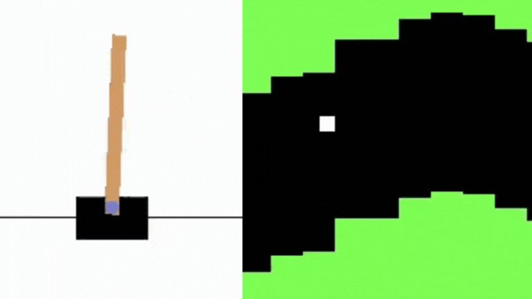

# Unit 4: Policy Gradient with Pytorch

You can find the unit theory [here](https://huggingface.co/deep-rl-course/unit4/introduction?fw=pt).

## HOW TO RUN

First check that you have the requirements listed [here](../README.md).

**IMPORTANT**: Before runing the following commands ensure that you are inside the unit folder.

### 1 - Build the Docker image

You only need to run this command once

    docker-compose build

### 2 - Run training

If you want to modify some hyperparameters you can do it in the configuration file [train.yaml](config/train.yaml).

    docker-compose run train

Each training run will create a folder in "*runs/train/\<DATETIME\>/*". You will find there the experiment outputs (like the trained model, hyperparameters used...).
    
By default, it is going to train an agent using the **Pixelcopter** environment. To change the environment you have to modify the *train_env* and *eval_env* fiels in [train.yaml](config/train.yaml). To use the **Cartpole** environment you shoud put:

    defaults:
        - _self_
        - train_env: cartpole_v1
        - eval_env: cartpole_v1

### 3 - Push the trained model to the Hub

Before pushing the model to the Hub **YOU MUST** edit the file [model_to_hub.yaml](config/model_to_hub.yaml). You should at least change the *model_dir* (with the format "*runs/train/\<DATETIME\>/*") and *repo_id* to push the model to you personal repository.

    docker-compose run model_to_hub
