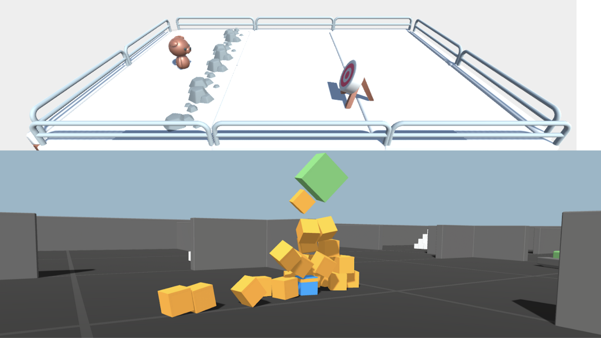

# Unit 5: Introduction to Unity ML-Agents

You can find the unit theory [here](https://huggingface.co/deep-rl-course/unit5/introduction?fw=pt).

## HOW TO RUN

First check that you have the requirements listed [here](../README.md).

**IMPORTANT**: Before runing the following commands ensure that you are inside the unit folder.

### 1 - Build the Docker image

You only need to run this command once

    docker-compose build

### 2 - Run training

To select the environment to train you can do it by changing the *ENV* variable in [train.sh](train.sh). The available environments are *Pyramids* and *SnowballTarget*.

If you want to modify the hyperparameters you can do it in the configuration files [Pyramids_params.yaml](Pyramids_params.yaml) or [SnowballTarget_params.yaml](SnowballTarget_params.yaml) depending on the environment in which you are going to train.

    docker-compose run train
   
Each training run will create a folder in "*runs/train/\<DATETIME\>/*". You will find there the experiment outputs (parameters used, model checkpoints...).
    
### 3 - Push the trained model to the Hub

Before pushing the model to the Hub **YOU MUST** edit the file [model_to_hub.sh](model_to_hub.sh). You should at least change the *RUN_ID* (*\<DATETIME\>* of your training run) and the *REPO_ID* to push the model to you personal repository.

    docker-compose run model_to_hub
