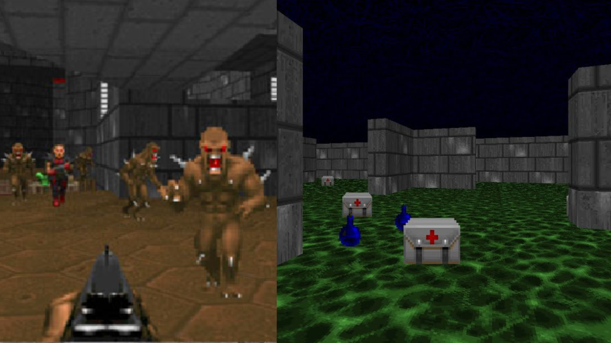

# Unit 8: Proximal Policy Optimization with Doom (Part 2)

You can find the unit theory [here](https://huggingface.co/deep-rl-course/unit8/introduction-sf?fw=pt).

## HOW TO RUN

First check that you have the requirements listed [here](../README.md).

**IMPORTANT**: Before runing the following commands ensure that you are inside the unit folder.

### 1 - Build the Docker image

You only need to run this command once

    docker-compose build

### 2 - Run training and pusth the model

In this unit the train script also pushes the model to the hub after training. Use the following command to run it:

    docker-compose run train

If you want to modify some hyperparameters you can do it in the *main* function of the [train.py](train.py) script. You **MUST** change the *hf_username* variable to use your hugging face account. It is also recomended to check that the *n_workers* variable is equal or lower to the number of cores of your CPU.

The results of the experiments are stored in the *runs* folder, which is automatically created.
